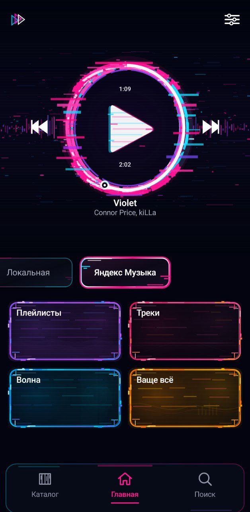
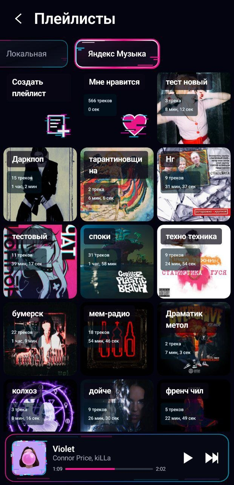
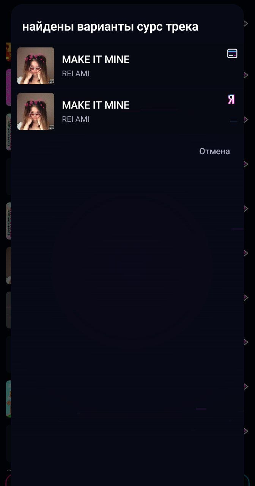

# Движ

«Движ» — музыкальный клиент и плеер с общей Kotlin/Compose-кодовой базой для
Android и Windows. Приложение работает с Яндекс Музыкой и локальной медиатекой;
Windows-версия пока развивается как desktop-порт и имеет отдельные
[ограничения](desktopApp/README_WINDOWS_PORT.md#ограничения-текущей-версии).

## Что уже умеет

- Авторизация в Яндекс Музыке через OAuth Device Flow.
- «Моя волна»: запуск радио, подгрузка треков и feedback-события для старта,
  пропуска и прослушивания.
- Библиотека Яндекс Музыки: плейлисты, любимые треки, создание плейлистов,
  добавление и удаление треков.
- Локальная медиатека, собственный каталог в Room и локальные плейлисты с
  экспортом в M3U/M3U8.
- Единая доменная модель песни для версий из Яндекс Музыки и локальных файлов.
- Общий Compose-интерфейс, репозитории и настройки для Android и Windows.
- Фоновое воспроизведение и системное управление через Media3/MediaSession на
  Android; JavaFX-аудиобэкенд и Windows taskbar controls на desktop.

## Устройство проекта

- `:shared` — Kotlin Multiplatform-модуль с общим Compose UI, навигацией,
  доменной логикой, репозиториями, Room-моделями и ресурсами для Android/JVM.
- `:app` — Android-приложение: Android lifecycle, MediaStore, Media3,
  разрешения, foreground service и платформенное хранилище.
- `:desktopApp` — Windows/JVM-приложение поверх `:shared`: JavaFX playback,
  файловая медиатека, desktop lifecycle и упаковка в EXE/MSI.
- `:yaMusicSdk` — Git submodule и самостоятельная Kotlin/JVM-библиотека для
  API Яндекс Музыки и Yandex ID.

`YaMusicSDK` использует знания о контрактах и поведении API из
[MarshalX/yandex-music-api](https://github.com/MarshalX/yandex-music-api), но
не является построчным переносом Python-библиотеки на Kotlin.

## Требования

- Git с поддержкой submodules;
- JDK 21;
- Android Studio и Android SDK 36 для сборки Android-приложения;
- Windows для запуска desktop-модуля и сборки EXE/MSI.

Android-приложение поддерживает устройства с Android 8.0 (API 26) и новее.

## Клонирование

```powershell
git clone --recurse-submodules https://github.com/Yellastro2/DWIJ_v3.git
cd DWIJ_v3
```

Если репозиторий уже был клонирован без submodules:

```powershell
git submodule update --init --recursive
```

## Локальная настройка

Создайте в корне `local.properties`. Android Studio обычно сама добавляет туда
`sdk.dir`; параметры OAuth задаются вручную:

```properties
YANDEX_OAUTH_CLIENT_ID=...
YANDEX_OAUTH_CLIENT_SECRET=...
```

`local.properties` относится только к конкретному компьютеру и исключён из
Git. Для desktop-упаковки можно дополнительно указать JDK:

```properties
DESKTOP_JAVA_HOME=C:/Program Files/Java/jdk-21
```

Если `DESKTOP_JAVA_HOME` отсутствует, Compose Desktop использует JDK, на
котором запущен Gradle. OAuth-параметры packaged Windows-приложению также можно
передать через `DWIJ_YANDEX_OAUTH_CLIENT_ID` и
`DWIJ_YANDEX_OAUTH_CLIENT_SECRET`.

## Запуск и сборка

Android-приложение можно запустить конфигурацией `app` в Android Studio или
собрать из PowerShell:

```powershell
.\gradlew.bat :app:assembleDebug
```

Запуск Windows-приложения:

```powershell
.\gradlew.bat :desktopApp:run
```

Сборка установщиков Windows:

```powershell
.\gradlew.bat :desktopApp:packageExe
.\gradlew.bat :desktopApp:packageMsi
```

Основные локальные тесты:

```powershell
.\gradlew.bat :app:testDebugUnitTest
.\gradlew.bat :desktopApp:test
.\gradlew.bat :yaMusicSdk:test
```

Инструментальные Android-тесты требуют подключённого устройства или эмулятора.

## Скриншоты

 
 

## Лицензия

«Движ» распространяется по лицензии GNU General Public License v3.0
(GPL-3.0). Использование, изучение, изменение и распространение исходного кода
допускаются на условиях этой лицензии; распространяемые производные версии
должны сохранять GPL-3.0 и доступность соответствующего исходного кода.
